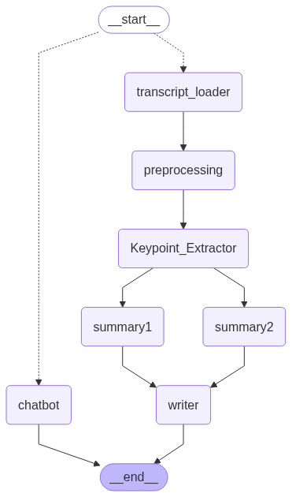
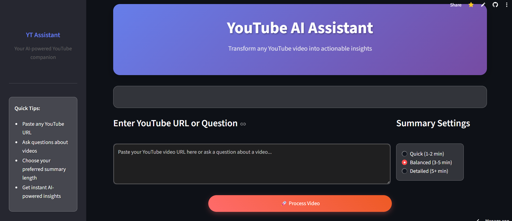
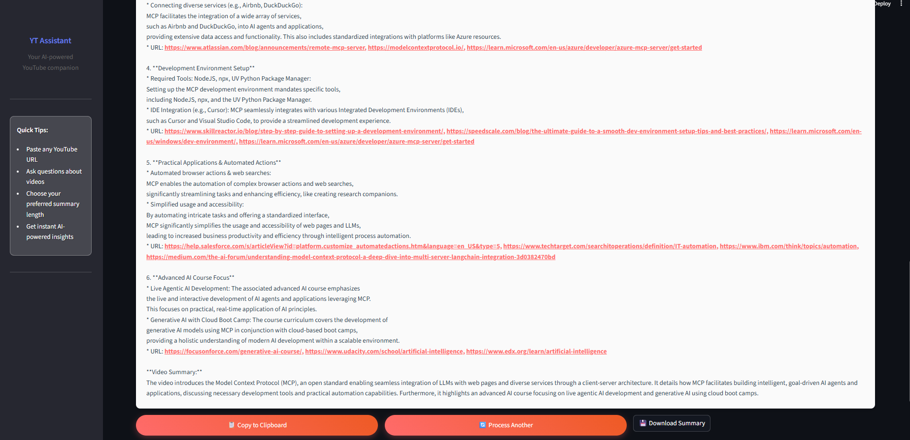

# 🎥 LLM-Powered YouTube Video Summarizer

**VidSage** is a smart AI-powered tool that summarizes YouTube videos with incredible precision. Leveraging LangGraph and LLMs like OpenAI or Groq, it extracts keypoints, generates structured summaries of varying lengths (short / medium / long), and gives you the essence of any video in seconds.

---

## 🚀 Features

- 🔗 Accepts **YouTube video URLs** or **custom user questions**
- ⏱️ Summarizes videos from **10 minutes to 4+ hours** with ease
- 🧠 Extracts **key concepts & subtopics** using concurrent LLM calls
- ✂️ Generates **two summaries** from different models
- 📌 Final summary tailored to selected **length**: short / medium / long
- 🔄 Combines summaries + keypoints into a **structured format**
- 🌐 **Clickable URLs** included in summary for further exploration
- 💾 Option to **download** summary as `.txt` or **copy** to clipboard
- ⚡ Built with **LangGraph** for modular, parallel, and async workflows
- 🖥️ Optional **Streamlit UI** for seamless interaction

---

## 📸 Work flow and Demo

**Workflow**

**Demo**

